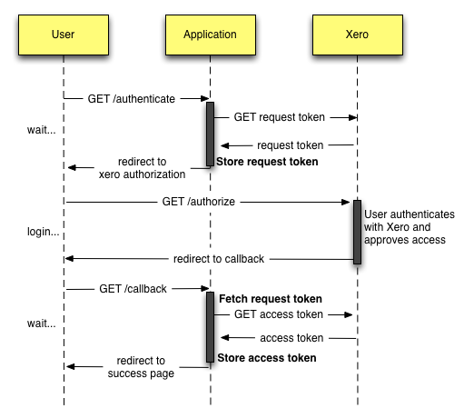

Xero PUBLIC application using API client implemented in node.js
---------------------------------------------------------------

A Xero *PUBLIC* application obtains a 30 minute access token using three-legged oAuth1.0.

This sample application uses the standard [oauth npm](https://www.npmjs.com/package/oauth) to authenticate with Xero and access the API endpoints.
 
Three-legged oAuth 1.0 requires that the application (the oAuth consumer) provides endpoints (views) for the user to initiate the authentication and redirect to and from Xero. For this example I've used [hapi.js](http://hapijs.com), but if you express or koa there's only subtle differences with the request and response arguments.
 
 
 
There's a lot of comments in the code, but for an explanation see [my blog](http://pooloferrors.com/2015/06/10/xero-public-application-node.html).

Getting started
---------------

1. Clone the repo
2. Install the packages
    
    `npm init`
    
3. Run it (the defaults are localhost on port 8001)
    
    `node src/server.js`
    
4. Browse to http://localhost:8001/ and authenticate with Xero.

Configuration
-------------

Here's what you'll want to change if you copy the code:

1. Your consumer token and secret generated by Xero
2. The two end-point URLs
3. The callback URL
4. For the endpoint's you need to access, create functions that invoke the endpoint via the oauth module (eg. oauth.get()) and work with the Resposne object.
 
 